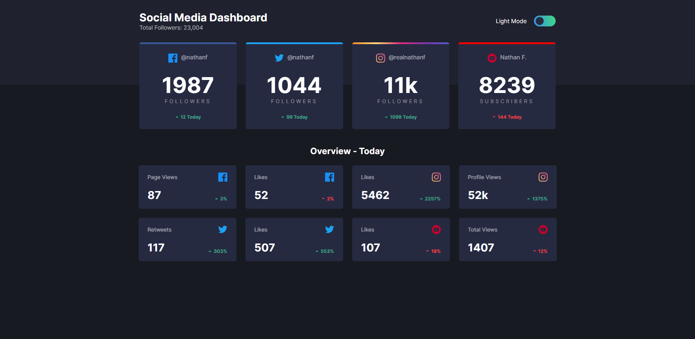
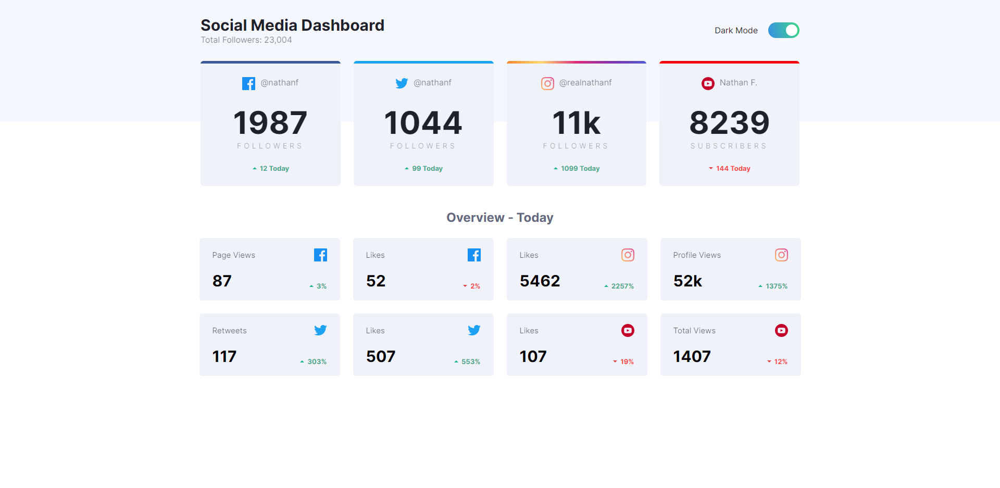
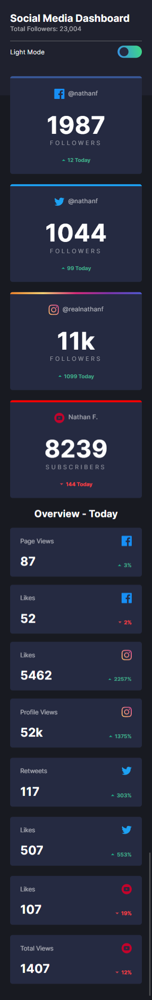
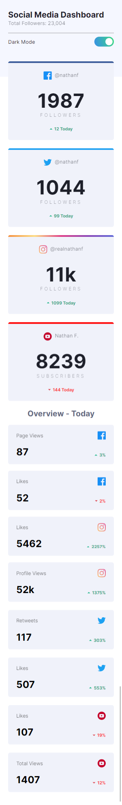

## Getting Started

First, run the development server:

```bash
yarn install
# or
yarn dev
```

Open [http://localhost:3000](http://localhost:3000) with your browser to see the result.

You can start editing the page by modifying `pages/index.js`. The page auto-updates as you edit the file.

## Desktop Screenshots

### Desktop Dark Mode



### Desktop Light Mode



## Mobile Screenshots

### Mobile Dark Mode



### Mobile Light Mode


